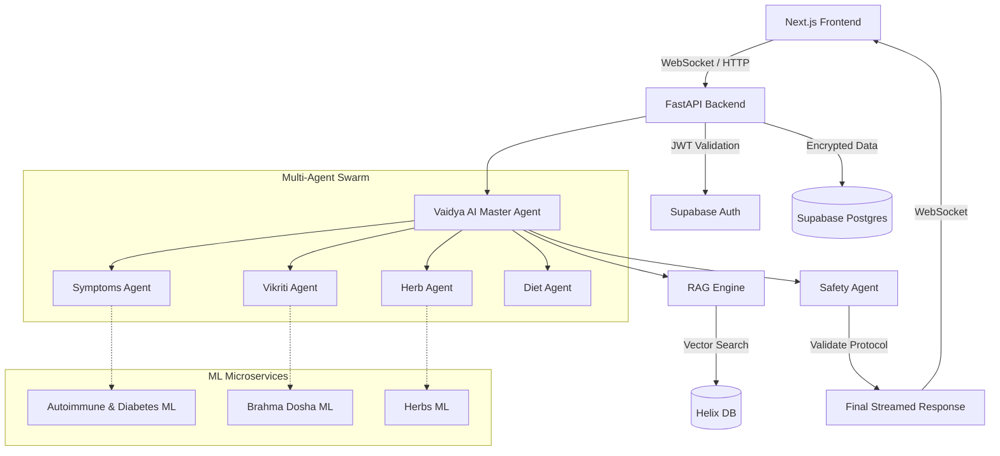

<div align="center">
  <h1>🌿 Dravya Labs</h1>
  <p><b>AI-Powered Ayurvedic Wellness, Rooted in Tradition, Powered by Intelligence</b></p>
</div>

---

Dravya Labs is a next-generation AI-powered Ayurvedic wellness platform. It merges ancient Indian health wisdom with state-of-the-art AI technology to provide safe, personalized, and deeply educational wellness guidance. 

By evaluating your natural body constitution (**Prakriti**) and analyzing your current imbalances (**Vikriti**) based on your symptoms, Dravya Labs recommends tailored herbs, dietary habits, and lifestyle changes using strictly verified classical Ayurvedic knowledge.

> ⚠️ **Medical Disclaimer:** This platform provides *educational wellness guidance only*. It is NOT designed to diagnose diseases, replace medical doctors, or prescribe medicines. We ALWAYS recommend professional consultation for serious symptoms.

---

## ✨ Key Features

- 🤖 **Agent-to-Agent (A2A) Architecture:** Powered by a swarm of specialized LangGraph agents (Prakriti, Vikriti, Herbs, Diet, and Safety) coordinated by the Master Orchestrator (Vaidya AI).
- 🧠 **Multi-Model Intelligence:** Integrates over 10 specialized ML microservices (Autoimmune, Diabetes, PCOS, Skin, Dietplain, etc.) to validate dosha imbalances.
- ⚡ **Real-Time Streaming:** Features a robust WebSockets implementation to stream live progress of the AI pipeline directly to the frontend.
- 🔐 **Military-Grade Encryption:** Protects patient health data at rest using `XSalsa20-Poly1305` (libsodium/PyNaCl).
- 📚 **Retrieval-Augmented Generation (RAG):** Grounds all LLM responses in classical Ayurvedic texts using **Helix DB** for vector similarity search.
- 🚀 **High Performance:** Implements async Redis connection pooling to aggressively cache LLM and ML model predictions.

---

## 🏗️ How it Works: The Data Flow

1. **Secure Ingestion:** The user submits symptoms via the Next.js frontend. The backend encrypts personal identifiers, sending only medical context into the AI Core.
2. **Concurrent Inference:** The Orchestrator triggers specialist agents to query the ML models simultaneously to detect disease risk flags and dosha imbalances.
3. **Database Grounding (RAG):** The system searches Helix DB for relevant classical text passages to strictly ground the advice.
4. **Safety Validation:** ALL generated recommendations are passed through a strict Safety Agent. Dangerous herb combinations or critical risk profiles trigger an emergency medical warning and block herbal outputs.
5. **Streaming Output:** The final personalized protocol (Herbs, Diet, Home Remedies) is streamed back to the user via WebSockets in real-time.

## 🏗️ System Architecture

Dravya Labs employs a modern, event-driven microservices architecture. 



---

## 📂 Folder Architecture

```text
Dravya-labs/
├── backend/                 # Python FastAPI Backend
│   ├── agents/              # LangGraph Agents (Orchestrator, Prakriti, Safety, etc.)
│   ├── app/
│   │   ├── core/            # Config and Security (JWT, Encryption)
│   │   ├── routes/          # REST API endpoints (FastAPI routers)
│   │   ├── services/        # Third-party integrations (Redis Cache, Helix, Supabase)
│   │   └── utils/           # Helpers (Event Bus for WebSockets, crypto tools)
│   ├── memory/              # RAG implementations (Health Context retrieval)
│   ├── model_clients/       # Asynchronous HTTP clients for ML microservices
│   ├── main.py              # Application entry point & WebSocket handlers
│   └── requirement.txt      # Python dependencies
│
├── frontend/                # Next.js 16 Frontend
│   ├── src/
│   │   ├── app/             # Next.js App Router (pages and layouts)
│   │   ├── components/      # React components (Radix UI, Tailwind CSS)
│   │   └── lib/             # API helpers and utilities
│   └── package.json         # Node dependencies
│
└── README.md                # Project documentation
```

---

## 🛠️ Tech Stack

### AI & Backend
- **Framework:** Python 3.11+, FastAPI
- **LLM Engine:** Mistral Large (with Multi-LLM routing/voting support)
- **Agent Orchestration:** LangGraph
- **Vector Database:** Helix DB + sentence-transformers (HF)
- **Caching & Pub/Sub:** Redis (`redis.asyncio`)
- **Encryption:** PyNaCl (libsodium)
- **Authentication:** Strict Supabase Auth + JWT

### Frontend
- **Framework:** Next.js 16 (React 19)
- **Styling:** Tailwind CSS 4, Radix UI
- **Data Visualization:** Recharts

---

## 🚀 Quick Start

### 1. Prerequisites
- Python 3.11+
- Node.js 18+
- Redis Server (e.g., `brew install redis && brew services start redis`)
- Supabase Project & Helix DB Instance

### 2. Backend Setup
```bash
cd backend
python -m venv venv
source venv/bin/activate
pip install -r requirement.txt

# Set up your environment variables
cp .env.example .env
# Edit .env to add your Mistral, Supabase, Helix DB, and Redis credentials

# Start the server
uvicorn main:app --reload --port 8000
```

### 3. Frontend Setup
```bash
cd frontend
npm install

# Set up your environment variables
cp .env.local.example .env.local

# Start the dev server
npm run dev
```

---

## 🔒 Security & Privacy

Dravya Labs is built on the principle of privacy-by-design. 
- API Endpoints strictly validate Supabase JWT tokens via HTTP Bearer headers.
- Health profiles and chat session data are encrypted using `PyNaCl` before ever touching the Supabase PostgreSQL database. 
- No plaintext medical data is stored at rest.

---

<div align="center">
  <i>Built with ❤️ for the future of holistic health.</i>
</div>
