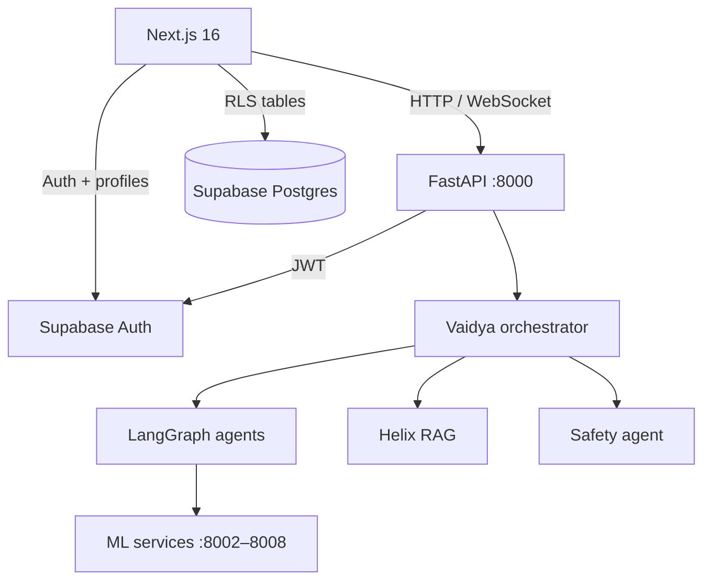

<div align="center">
  <h1>🌿 Dravya Labs</h1>
  <p><b>AI-powered Ayurvedic wellness — rooted in tradition, built for the screen you are on.</b></p>
</div>

---

Dravya Labs is an Ayurvedic intelligence product: a public marketing site, authenticated app, FastAPI orchestrator, and a set of ML microservices. It estimates **Prakriti** (constitution) and **Vikriti** (current imbalance) from symptoms and habits, then recommends herbs, diet, and lifestyle using classical sources plus model checks.

> **Medical disclaimer:** Educational wellness guidance only. It does not diagnose disease, replace a clinician, or prescribe medicine. Seek professional care for serious symptoms.

---

## What is in the product now

### Public landing (`/`)

Full-viewport sections, playful lime / mint / yellow UI, **Lenis** smooth scroll, **GSAP** enter/exit reveals on every section.

| Section | What you see |
| --- | --- |
| **Hero** | Background video (`/homebg.mp4`), highlighter heading, Get Started, feature chips |
| **About** | Copy + organic clip-path plant gallery |
| **Encyclopedia** | Stacked herb carousel (autoplay, Lenis-friendly) |
| **Features** | How it works steps (prakriti → library → AI → tracking) |
| **Pricing** | Starter / Pro / Clinic, monthly vs annual (10% off), glass cards, no hidden-fee copy |
| **Footer** | Reveal footer (fixed behind the page; shows only at the end of the scroll) |

The old **Solution** block was removed. Nav is About · Features · Pricing.

Horizontal swipe no longer peeks the footer: overflow is clipped, Lenis is vertical-only, and the footer stays hidden until the reveal spacer.

### App (after login)

- Email/password and **Google OAuth** via Supabase (`/auth/callback` → profile or dashboard)
- Dashboard, encyclopedia, saved items, AI consult streaming
- Profile row in `public.users` (created on first Auth user via trigger)

### AI stack

LangGraph agents (symptoms, vikriti, herbs, diet, safety) behind FastAPI + WebSockets. Optional Helix RAG and Redis cache. Health JSON encrypted at rest with PyNaCl.

---

## Architecture


```mermaid
graph TD
    Browser[Next.js 16] -->|HTTP / WebSocket| API[FastAPI :8000]
    Browser -->|Auth + profiles| SBAuth[Supabase Auth]
    Browser -->|RLS tables| SBDB[(Supabase Postgres)]
    API -->|JWT| SBAuth
    API --> Orch[Vaidya orchestrator]
    Orch --> Agents[LangGraph agents]
    Agents --> ML[ML services :8002–8008]
    Orch --> RAG[Helix RAG]
    Orch --> Safety[Safety agent]
```

---

## Repository layout

```text
Dravya-labs/
├── frontend/                      # Next.js 16 (App Router) — bun
│   ├── app/(public)/landing/      # Marketing page + landing.css
│   ├── app/(auth)/                # login, signup, callback, profile
│   ├── components/landing/        # hero bar, carousel, features, pricing, footer
│   └── .env                       # NEXT_PUBLIC_SUPABASE_* , BACKEND_URL
├── backend/                       # FastAPI orchestrator
│   ├── migrations/
│   │   ├── 000_complete_schema.sql    # run once in Supabase SQL editor
│   │   └── 001_fix_auth_trigger.sql   # if Auth returns 500 unexpected_failure
│   ├── requirement.txt
│   └── .env.example
├── herbs/  Autoimmune/  dietplain/  brahma/
├── symptom_treatment/  skin/  diabetes/
├── start-ml-services.bat          # Windows: launch all ML windows
├── start-ml-services.command      # macOS helper
└── README.md
```

Frontend lives at `frontend/app`, not `frontend/src`.

---

## Tech stack

| Layer | Stack |
| --- | --- |
| Frontend | Next.js 16, React 19, Tailwind 4, GSAP, Lenis, Motion, Zustand, TanStack Query |
| Auth / DB | Supabase Auth (email + Google), Postgres + RLS |
| API | FastAPI, LangGraph, PyNaCl, Redis |
| ML | Separate FastAPI apps (keep **TensorFlow 2.16.1** pins; do not bump casually) |

---

## Quick start

### Prerequisites

- Python 3.11+
- [Bun](https://bun.sh) (or Node 18+)
- Redis (optional locally: `redis-server`)
- A [Supabase](https://supabase.com) project

### 1. Database

In **Supabase → SQL Editor**, run:

1. `backend/migrations/000_complete_schema.sql`
2. If Google / signup returns `{ "error_code": "unexpected_failure" }`, run `backend/migrations/001_fix_auth_trigger.sql`

That creates `users`, health/chat/analysis, saved items, feedback, LLM usage, RLS, and `handle_new_user` on `auth.users`.

### 2. Google OAuth

1. Google Cloud → Credentials → OAuth client (Web)
2. Authorized redirect URI: `https://<PROJECT_REF>.supabase.co/auth/v1/callback`
3. Origins: `http://localhost:3000` (and production origin)
4. Supabase → Authentication → Providers → Google: paste client ID + secret
5. URL config:
   - Site URL: `http://localhost:3000`
   - Redirect URLs: `http://localhost:3000/auth/callback`

### 3. Environment

**`frontend/.env`**

```env
NEXT_PUBLIC_SUPABASE_URL=https://xxxx.supabase.co
NEXT_PUBLIC_SUPABASE_ANON_KEY=your-anon-key
BACKEND_URL=http://localhost:8000
```

**`backend/.env`** (from `.env.example`)

```env
SUPABASE_URL=https://xxxx.supabase.co
SUPABASE_JWT_SECRET=your-jwt-secret
SUPABASE_SERVICE_ROLE_KEY=your-service-role-key
ENCRYPTION_KEY=your-64-char-hex-key
REDIS_URL=redis://localhost:6379/0
MISTRAL_API_KEY=...
```

Never put the service role key in the frontend.

### 4. ML services (Windows)

```bat
start-ml-services.bat
```

| Service | Port |
| --- | --- |
| herbs | 8002 |
| Autoimmune | 8003 |
| dietplain | 8004 |
| brahma | 8005 |
| symptom_treatment | 8006 |
| skin | 8007 |
| diabetes | 8008 |

macOS: `./start-ml-services.command` or start each `python -m app.main` in its folder.

### 5. Backend

```bash
cd backend
python -m venv .venv
# Windows: .venv\Scripts\activate
# macOS/Linux: source .venv/bin/activate
pip install -r requirement.txt
uvicorn main:app --reload --port 8000
```

### 6. Frontend

```bash
cd frontend
bun install
bun run dev
```

Open [http://localhost:3000](http://localhost:3000).

---

## Landing motion

Lenis owns page scroll (`orientation` / `gestureOrientation`: vertical). GSAP `ScrollTrigger` is updated from Lenis `raf` via `gsap.ticker`. Hero animates on load; About, Encyclopedia, Features, and Pricing play on enter and reverse on leave. Footer layers scrub in only when the reveal spacer hits the viewport.

---

## Pricing (marketing copy)

Displayed on the landing page (not billed in-app yet):

| Plan | Monthly | Annual (10% off) |
| --- | --- | --- |
| Starter | $0 | Free |
| Pro | $15 | $13.50/mo, billed $162/year |
| Clinic | $25 | $22.50/mo, billed $270/year |

Copy states no setup fees, cancel anytime, same features on annual, USD with tax only at checkout if it applies.

---

## Security

- Browser uses the **anon** key; RLS scopes rows to `auth.uid()`.
- Backend uses JWT verification + **service role** for server jobs.
- Encrypted health payloads use PyNaCl `SecretBox` before Postgres.
- Auth trigger `handle_new_user` is written so a profile insert failure does not 500 Auth.

---

<div align="center">
  <i>Built for holistic health, with care for what we store and what we claim.</i>
</div>
