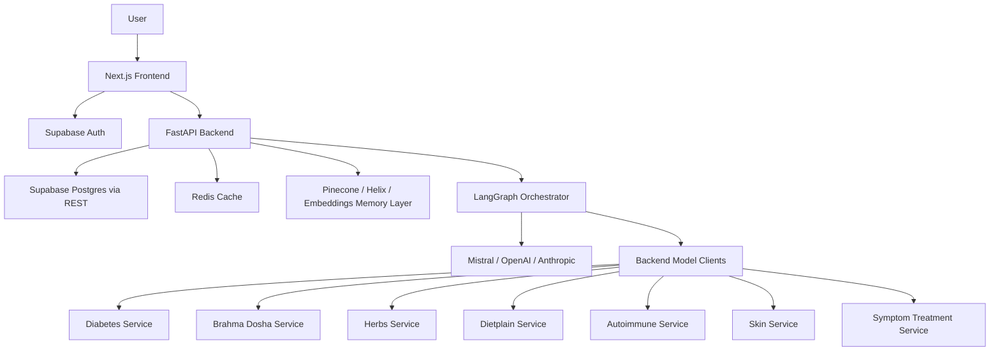

# Dravya Labs Repository Analysis

## 1. Executive Summary

Dravya Labs is an AI-powered Ayurvedic wellness platform. The repository combines:

- A Next.js frontend for authentication, onboarding, dashboards, chat-based symptom analysis, herb encyclopedia pages, saved items, and treatment plans.
- A Python FastAPI orchestrator backend that validates users, fetches encrypted health profiles, calls LLM agents, calls ML microservices, stores chat/history data, and exposes the main app APIs.
- Multiple standalone ML microservices for Ayurvedic and health prediction tasks such as prakriti/dosha, herb retrieval, diet recommendation, autoimmune risk, diabetes prediction, skin analysis, and symptom-to-treatment mapping.
- Data, notebooks, and training scripts used to generate model artifacts.
- Supabase SQL migrations and backend integration code for profiles, sessions, feedback, saved items, and analysis history.

At a product level, the application works like a personalized Ayurvedic assistant: a user signs in, completes a health profile, enters symptoms, and receives a safety-first wellness analysis with dosha interpretation, herbs, diet advice, lifestyle guidance, and treatment-plan follow-up options.

This is not a single monolithic application. It is closer to a service-oriented AI system: the frontend talks to the backend, the backend orchestrates LLM reasoning and model services, and each model service owns its own training/inference lifecycle.

## 2. Repository Structure

```text
Dravya-labs/
├── frontend/             # Next.js 16 + React 19 user application
├── backend/              # FastAPI AI orchestrator backend
├── skin/                 # Skin image classification service
├── diabetes/             # Diabetes LightGBM prediction service
├── brahma/               # Prakriti/dosha prediction service
├── herbs/                # Herb recommendation/retrieval service
├── dietplain/            # Food/nutrition recommendation service
├── Autoimmune/           # Autoimmune disorder prediction service
├── symptom_treatment/    # Symptom-to-Ayurvedic-treatment service
├── docs/                 # Existing architecture/optimization documentation
├── README.md             # Main project overview
├── quick start.md        # Quick-start notes
├── meta-prompt.md        # Prompt specification for the multi-agent system
└── start.command         # Startup helper script
```

## 3. Main Technologies Used

### Frontend

| Area | Technology |
|---|---|
| Framework | Next.js 16 App Router |
| UI runtime | React 19 |
| Language | TypeScript |
| Styling | Tailwind CSS 4 |
| UI primitives | Radix UI, lucide-react, react-icons |
| State/client utilities | Zustand, React Query, React Context |
| Charts | Recharts |
| Animation | GSAP, anime.js |
| Markdown rendering | react-markdown, remark-gfm |
| Auth/data client | Supabase SSR/client SDK |

### Backend

| Area | Technology |
|---|---|
| Web framework | FastAPI |
| Server | Uvicorn |
| Validation | Pydantic |
| Agent orchestration | LangGraph |
| LLM API calls | httpx-based direct client |
| LLM providers | Mistral by default, optional OpenAI and Anthropic routing |
| Auth | Supabase JWT verification with python-jose |
| Database integration | Supabase PostgREST |
| Caching | Redis async cache for ML client responses |
| Vector/RAG layer | Helix DB settings, Pinecone memory modules, sentence-transformers embeddings |
| Encryption | PyNaCl SecretBox |
| Resilience | tenacity retries, graceful ML-service degradation |

### ML Services

| Service | Purpose | Current stack observed |
|---|---|---|
| `diabetes` | Diabetes risk prediction from tabular medical features | FastAPI + LightGBM + scikit-learn |
| `brahma` | Prakriti/dosha prediction from physical/lifestyle traits | Mixed state: README/model code mention PyTorch, requirements/training include LightGBM |
| `herbs` | Herb matching/recommendation | Mixed state: README mentions PyTorch, requirements show LightGBM |
| `dietplain` | Food recommendation from nutrition targets | Mixed state: README mentions PyTorch, requirements show LightGBM |
| `Autoimmune` | Autoimmune disorder risk/details | FastAPI + LightGBM requirements |
| `symptom_treatment` | Ayurvedic disease/treatment prediction | FastAPI + LightGBM requirements |
| `skin` | Skin condition classification from images | README says EfficientNet/PyTorch, requirements include TensorFlow; implementation should be rechecked before deployment |

There is documentation drift in several model folders. Some README files still describe PyTorch `.pth` workflows, while current requirements files indicate a LightGBM migration has happened or is in progress. Treat the code and generated artifacts as the source of truth before running a service.

## 4. How The System Works

### High-Level Runtime Flow

1. The user opens the Next.js frontend.
2. Supabase handles authentication on the client side.
3. The user completes onboarding with basic profile, health metrics, diet information, and medical history.
4. The frontend sends profile/onboarding data to backend routes, where health JSON is encrypted with PyNaCl and stored in Supabase.
5. The user enters symptoms in the chat page.
6. The frontend calls the FastAPI backend `/api/analyze` endpoint.
7. The backend verifies the Supabase JWT, fetches/decrypts the user profile, builds a `SharedState`, and starts the AI pipeline.
8. The backend orchestrator runs either:
   - the hierarchical pipeline, currently defaulted to `USE_HIERARCHICAL_ORCHESTRATOR=true`, or
   - the older linear LangGraph pipeline if the flag is disabled.
9. The orchestrator calls ML model clients and LLM agents.
10. Safety validation is applied before returning user-facing guidance.
11. The backend stores or updates chat-session context and can save consultation memory.
12. The frontend renders the analysis as chat output, including severity, dosha, herbs, lifestyle tips, and optional treatment plan entry.

### Simplified Architecture



## 5. Frontend Analysis

The frontend is located in `frontend/` and uses the App Router layout model. It has route groups for public pages, auth pages, main authenticated pages, and professional pages.

Important frontend areas:

- `frontend/app/(public)/landing`: public landing experience.
- `frontend/app/(public)/encyclopedia`: herb encyclopedia and herb detail pages.
- `frontend/app/(auth)`: login, signup, onboarding, profile auth flows.
- `frontend/app/(main)/dashboard`: authenticated wellness dashboard.
- `frontend/app/(main)/chat`: main AI consultation chat.
- `frontend/app/(main)/treatment`: treatment-plan generation and review flow.
- `frontend/app/(main)/history`: previous sessions/history UI.
- `frontend/app/(main)/profile`: user profile UI.
- `frontend/app/(main)/feedback`: feedback surface.
- `frontend/app/api/*`: local Next API handlers for auth/profile/saved-item helpers.

The frontend service layer is centered around `frontend/lib/ai-service.ts`. It defines TypeScript interfaces matching the FastAPI responses and calls these backend endpoints:

- `GET /api/health`
- `POST /api/analyze`
- `POST /api/chat`
- `GET /api/chat/sessions`
- `DELETE /api/chat/sessions/{session_id}`
- `POST /api/treatment/generate`
- `POST /api/treatment/review`

`frontend/config/api.ts` defaults to `NEXT_PUBLIC_BACKEND_URL` or `http://localhost:8000`. It also sets `AI_TIMEOUT` to 180 seconds, which reflects that full AI analysis can be long-running.

Frontend strengths:

- Clear separation between UI components, contexts, hooks, and service calls.
- Typed API service layer for backend integration.
- Supabase client configuration guards against missing environment variables.
- Rich UI with dashboard cards, chat Markdown rendering, animations, herb assets, and treatment-plan interactions.

Frontend concerns:

- Several calls in `ai-service.ts` do not attach Authorization headers, while the backend now expects `verify_user` on core endpoints. This may cause 401s unless another auth path exists or backend auth is relaxed.
- Some frontend request types include `user_id`, but the current backend depends on JWT for user identity in key endpoints.
- The chat page currently calls the blocking `/api/analyze` path, even though the backend also exposes `/api/analyze/async` and `/ws/analyze/{task_id}`.

## 6. Backend Analysis

The backend is the main AI gateway. It is located in `backend/`.

### Key Backend Files

| File/folder | Purpose |
|---|---|
| `backend/main.py` | FastAPI app, CORS, core endpoints, WebSocket analysis events, profile fetching, treatment generation |
| `backend/agents/schemas.py` | Shared Pydantic models for user input, agent output, pipeline state, and API responses |
| `backend/agents/orchestrator_agent.py` | Legacy linear LangGraph pipeline and dispatcher to hierarchical mode |
| `backend/agents/hierarchical_orchestrator.py` | Newer supervisor-style orchestration |
| `backend/agents/ml_orchestrator.py` | Concurrent ML model execution layer |
| `backend/agents/llm_orchestrator.py` | LLM generation, routing, and critic-loop layer |
| `backend/agents/llm_client.py` | Unified direct HTTP LLM client |
| `backend/model_clients/` | HTTP clients for external ML microservices |
| `backend/app/routes/` | API routers for onboarding, chat sessions, feedback, agent routes, etc. |
| `backend/app/services/` | Supabase, Redis, embeddings, vector store, few-shot retrieval |
| `backend/memory/` | Health memory retrieval/storage |
| `backend/migrations/` | Supabase SQL migrations |

### Core Backend Endpoints

From `backend/main.py`, the major user-facing endpoints are:

- `POST /api/analyze`: Runs symptom analysis and returns `AnalysisResult`.
- `POST /api/analyze/async`: Starts background analysis and returns a task id.
- `WebSocket /ws/analyze/{task_id}`: Streams progress/completion events for async analysis.
- `POST /api/chat`: Sends follow-up chat messages to the LLM with profile and memory context.
- `POST /api/treatment/generate`: Generates a 7-day structured treatment plan.
- `POST /api/treatment/review`: Reviews treatment adherence/progress.
- `GET /api/health`: Basic backend health check.

The backend also includes routers for onboarding, feedback, chat sessions, and agent routes.

### Pipeline Modes

#### Linear Pipeline

The legacy graph runs this sequence:

```text
memory_retrieve
→ symptoms
→ prakriti
→ vikriti
→ dravya
→ ahara
→ safety
→ synthesize
→ memory_save
```

This mode is simple and readable, but slower because many LLM-heavy steps run sequentially.

#### Hierarchical Pipeline

The newer pipeline is enabled by `USE_HIERARCHICAL_ORCHESTRATOR`, which currently defaults to `true` in `backend/app/core/config.py`.

Conceptually, it separates:

- Model facts: run by an ML orchestrator.
- Language response: generated by an LLM orchestrator.
- Review/safety: handled by a critic/safety loop.
- Persistence: memory/profile/session storage.

This is a better architecture for latency, reliability, and future model routing.

## 7. AI And Agent System

The codebase is designed around an Ayurvedic multi-agent system:

- `Prakriti Agent`: estimates natural constitution/dosha.
- `Vikriti Agent`: estimates current imbalance.
- `Symptoms Agent`: aggregates model outputs and health flags.
- `Dravya Herb Agent`: recommends herbs.
- `Ahara Agent`: recommends diet and meal patterns.
- `Safety Agent`: validates contraindications and risky outputs.
- `Vaidya / Orchestrator`: synthesizes final user-facing guidance.
- `Critic Agent`: checks generated advice for consistency and safety in the newer flow.
- `LLM Router` and `LLM Ensemble`: route simple/complex/critical prompts and optionally vote across providers.

The main shared data object is `SharedState` in `backend/agents/schemas.py`. It carries:

- user profile
- health metrics
- diet information
- medical history
- symptom input
- image references
- prakriti/vikriti results
- disease risk
- herb/diet outputs
- safety verdicts
- memory context
- hierarchical ML facts and LLM response
- pipeline errors and metadata

This central schema is a good design choice because it keeps agent boundaries explicit.

## 8. ML Microservices

### Diabetes

Folder: `diabetes/`

This service uses LightGBM for diabetes prediction. It loads `diabetes_model.txt` and `scaler_params.json`, accepts standard tabular inputs such as pregnancies, glucose, blood pressure, insulin, BMI, pedigree function, and age, then returns a structured prediction.

### Brahma

Folder: `brahma/`

This service predicts Ayurvedic prakriti/dosha from 29 physical and lifestyle traits. The README describes a PyTorch neural network and `.pth` artifacts, while the current requirements file includes LightGBM. The folder also contains `train_lgb.py`, suggesting a migration from PyTorch to LightGBM.

### Herbs

Folder: `herbs/`

This service recommends or retrieves herbs for a query. It includes herb datasets, preprocessing scripts, lookup CSVs, and model metadata. The README still describes a PyTorch workflow, while current requirements include LightGBM.

### Dietplain

Folder: `dietplain/`

This service recommends foods based on meal type and nutritional targets such as calories, protein, carbs, fat, fiber, sugar, sodium, cholesterol, and water intake. Like other services, docs mention older neural workflows while dependencies indicate a LightGBM direction.

### Autoimmune

Folder: `Autoimmune/`

This service predicts autoimmune disorder risk/details using demographics, symptoms, labs, and antibody markers. It includes a large CSV dataset, training notebooks/scripts, model artifacts, disease lookup data, and FastAPI inference code.

### Symptom Treatment

Folder: `symptom_treatment/`

This service maps symptoms, doshas, and health metrics to Ayurvedic disease classifications and treatment protocols. It uses the AyurGenixAI dataset and exports treatment lookup artifacts.

### Skin

Folder: `skin/`

This service is for image-based skin disease detection. The README describes EfficientNet-B0/PyTorch training, but the current requirements include TensorFlow instead of PyTorch. The app structure includes FastAPI routes, inference, model loading, training scripts, dataset download helpers, and tests.

## 9. Data Storage And Persistence

### Supabase

Supabase is used for:

- auth identity
- user health profiles
- chat sessions
- analysis history
- saved items
- feedback data

The base schema in `backend/setup_supabase.sql` includes:

- `user_health_profiles`
- `chat_sessions`
- `analysis_history`
- `saved_items`

Additional migrations include:

- `002_feedback.sql`
- `003_saved_items.sql`

### Encryption

`backend/app/utils/encryption.py` uses PyNaCl `SecretBox` with `ENCRYPTION_KEY` from settings. Health JSON is encrypted before storage and decrypted when building user context.

Important operational note: the default encryption key in `backend/app/core/config.py` should be replaced in production. A checked-in default key is useful for local development but unsafe for real health data.

### Memory And RAG

The backend includes memory modules for storing and retrieving consultation context:

- `backend/memory/health_memory_manager.py`
- `backend/memory/vector_store.py`
- `backend/app/services/embeddings.py`
- `backend/app/rag/retriever.py`
- `backend/app/rag/context_builder.py`
- `backend/app/services/helix_db.py`
- `backend/app/services/pinecone.py`

The architecture intends to ground responses in prior user memory and vector-retrieved context. The README mentions Helix DB for classical Ayurvedic text grounding, while existing backend documents also mention Pinecone for user/session memory.

## 10. Feedback Flywheel

The backend includes infrastructure for a learning loop:

- `backend/app/routes/feedback_route.py`: stores feedback.
- `backend/app/services/few_shot_retriever.py`: retrieves positively rated examples.
- `backend/scripts/export_feedback.py`: exports feedback for future training or analysis.
- `backend/migrations/002_feedback.sql`: defines feedback storage.

The intended loop is:

```text
User response feedback
→ Supabase feedback table
→ few-shot examples for future prompts
→ weekly export
→ model/prompt improvement
```

This is a strong product direction because it connects real user judgment back into AI quality improvement.

## 11. Security And Safety

Strong points:

- Supabase JWT verification exists in `backend/app/core/security.py`.
- Backend user identity is derived from JWT `sub` in core endpoints.
- Health profile encryption uses PyNaCl SecretBox.
- Safety verdicts are represented explicitly with `SAFE`, `WARNING`, and `HIGH_RISK`.
- The system repeatedly frames output as educational wellness guidance, not diagnosis.

Concerns to address:

- The backend JWT verifier falls back to decoding without audience verification. This may be convenient during development but weakens verification.
- `jwt_debug.log` file logging from security code is not production-friendly and may leak operational detail.
- CORS origins are hard-coded to local development addresses in `main.py`.
- Frontend AI service calls currently do not consistently attach auth tokens to endpoints that require JWT verification.
- A default encryption key is present in config and must not be used in production.
- Health/wellness applications should add rate limiting, request-size limits, audit logging, and stronger error boundaries.

## 12. How To Run The Project Locally

The project is not a single-command stack yet. It should be run as multiple services.

### Backend

```bash
cd backend
python -m venv venv
venv\Scripts\activate
pip install -r requirement.txt
uvicorn main:app --reload --port 8000
```

Required environment variables include Supabase keys, JWT secret, LLM provider keys, Redis URL, vector DB settings, encryption key, and ML microservice URLs/API keys.

### Frontend

```bash
cd frontend
npm install
npm run dev
```

Important environment variables:

- `NEXT_PUBLIC_BACKEND_URL`
- `NEXT_PUBLIC_SUPABASE_URL`
- `NEXT_PUBLIC_SUPABASE_ANON_KEY`

### Model Services

Typical pattern:

```bash
cd <service-folder>
python -m venv venv
venv\Scripts\activate
pip install -r requirements.txt
uvicorn app.main:app --host 0.0.0.0 --port <port>
```

Common ports documented in the repo:

| Service | Port |
|---|---:|
| Backend orchestrator | 8000 |
| Herbs | 8002 |
| Autoimmune | 8003 |
| Dietplain | 8004 |
| Brahma | 8005 |
| Symptom treatment | 8006 |

## 13. Strengths Of The Repository

- Clear product idea: AI + Ayurveda + personalization + safety.
- Frontend and backend are separated cleanly.
- Backend has explicit schemas for agent communication.
- The AI pipeline is moving toward a more scalable hierarchical architecture.
- ML models are isolated as services, which allows independent training, deployment, and replacement.
- Redis caching and shared HTTP clients are already present in backend model clients.
- Feedback flywheel foundations are present.
- Supabase schema, profile storage, saved items, chat sessions, and analysis history are thought through.
- There is meaningful existing documentation in `README.md`, `backend/DRAVYA_BACKEND_MASTER.md`, and `docs/backend-optimization-report.md`.

## 14. Main Risks And Gaps

### 1. Documentation Drift

Several README files describe PyTorch `.pth` services, while requirements and newer scripts indicate LightGBM migration. This can confuse setup and deployment.

Recommended fix: update each model service README to state the current runtime, expected artifact filenames, and exact start command.

### 2. Auth Contract Mismatch

The backend expects JWT auth on important endpoints, but frontend service calls do not consistently include Authorization headers.

Recommended fix: centralize authenticated fetch logic in `frontend/lib/ai-service.ts` or a wrapper that reads the Supabase session token and attaches `Authorization: Bearer <token>`.

### 3. Long-Running Analysis Path

The frontend still calls the blocking `/api/analyze` endpoint, while the backend already has async task and WebSocket support.

Recommended fix: move the chat analysis flow to `/api/analyze/async` plus `/ws/analyze/{task_id}` for progress and better UX.

### 4. Service Orchestration

There is no visible Docker Compose file for launching backend, frontend, Redis, and all model services together.

Recommended fix: add Dockerfiles and a root `docker-compose.yml`.

### 5. Testing Coverage

The repo has limited visible automated tests. The `skin` service has tests, but the main backend pipeline and frontend integration need coverage.

Recommended fix: add backend pytest tests for auth, health, analyze request construction, model-client fallbacks, encryption roundtrip, and treatment plan parsing.

### 6. Production Hardening

The system needs stronger production controls before handling real health data:

- strict JWT verification
- no default encryption secrets
- secret management
- rate limiting
- structured audit logs
- error monitoring
- health checks for every external dependency
- clearer medical disclaimer enforcement

## 15. Recommended Next Steps

1. Fix frontend/backend auth alignment by attaching Supabase JWT tokens to backend API calls.
2. Update model service documentation to match actual LightGBM/TensorFlow/PyTorch runtime state.
3. Move analysis UX to the async WebSocket flow already present in `backend/main.py`.
4. Add Docker Compose for local multi-service development.
5. Add backend tests around encryption, auth, ML-client fallback, and `/api/analyze` request flow.
6. Replace the default encryption key with required environment-only configuration for production.
7. Add dependency health aggregation so `/api/health` can report Redis, Supabase, LLM, and model-service availability.
8. Consolidate Pinecone/Helix memory terminology and configuration so reads/writes use the same intended store.

## 16. Overall Assessment

Dravya Labs is an ambitious and well-scaffolded AI wellness platform. The strongest architectural idea is its separation of concerns: frontend UX, backend orchestration, model clients, individual ML services, memory, and feedback are all separated into recognizable layers.

The codebase is beyond a prototype in structure, but not yet production-clean. The main work now is alignment: align docs with code, align frontend auth with backend auth, align old pipeline paths with the newer async/hierarchical architecture, and align ML service artifacts with their current runtime dependencies.

Once those are cleaned up, the repository can become a strong foundation for a scalable Ayurvedic wellness assistant.
